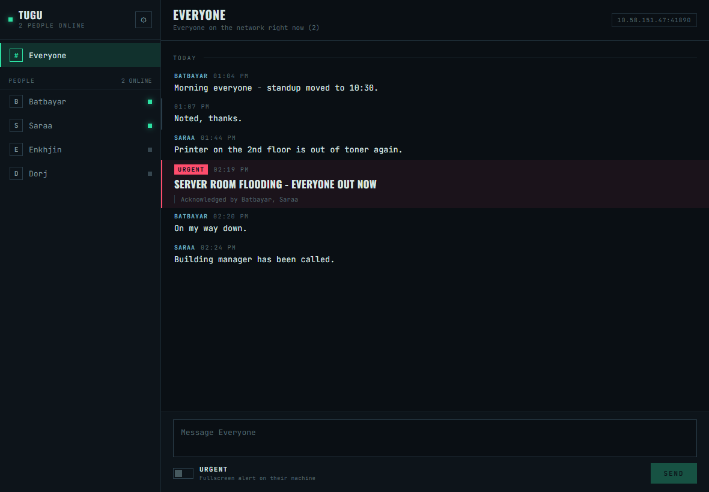
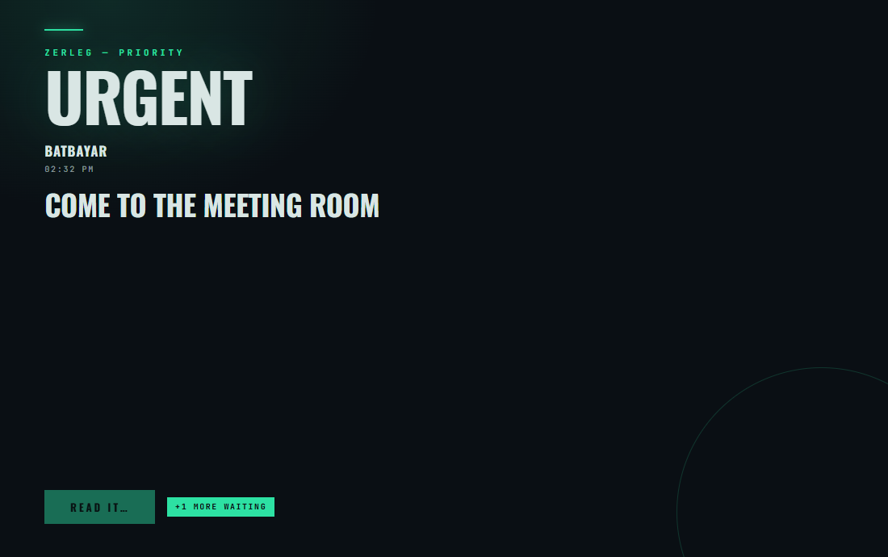

# ZERLEG CHAT

*Urgent LAN chat.*

A standalone desktop chat app for people on the same local network. **No server,
nothing to configure, nobody has to keep a PC running.** Install it, launch it,
and it finds everyone else running it.

It lives in the system tray, and its one distinguishing feature is the **instant
fullscreen urgent message**: when someone sends you an urgent message, your
screen is taken over by an always-on-top alert that stays there until you
acknowledge it.

<p align="center">
  <a href="https://github.com/Tugu1106/ZERLEG-CHAT/releases/latest/download/ZerlegChat-Setup.exe">
    
  </a>
</p>

<p align="center">
  <sub>Free &middot; no account &middot; no server &middot; nothing to configure</sub>
</p>

## Three steps, then it just works

1. **[Download](https://github.com/Tugu1106/ZERLEG-CHAT/releases/latest/download/ZerlegChat-Setup.exe)** and run it. No admin rights needed.
2. Allow it through the firewall when Windows asks (**Private networks**).
3. Open Settings, type your name.

That is the whole setup. Everyone else who does the same appears in your list
automatically - there is no server to point at, no address to type, and nobody
has to keep a machine running.



When someone sends an urgent message, this takes over the whole screen and stays
until you acknowledge it:



The alert style travels with the message - the sender picks how their alerts look
on everyone else's screen:


## Read this before deploying it

Zerleg Chat is built for a **trusted office network**. It has deliberately
simple security, and you should know exactly what that means:

* **No authentication.** Anyone who can reach your machine on this network can
  appear in your contact list under any name they choose, and can send you a
  fullscreen alert. There is no way to prove someone is who their name says.
* **No encryption.** Messages cross the network in plain text. Anyone able to
  capture traffic on the segment can read them.
* **It can take over your screen.** That is the entire point, but it also means
  a malicious peer on the same network can interrupt you at will.

That is an acceptable trade for a small office where you know everyone on the
LAN. It is **not** suitable for a shared/coworking network, a university
network, public Wi-Fi, or anywhere you do not trust every device on the subnet.

There is also **no auto-update**: if a fix ships, everyone reinstalls manually.

## Building it yourself

Only needed if you want to change something - most people should just use the
download button above.

```bash
npm run setup
npm run dist       # -> desktop/release/ZerlegChat-Setup.exe
```

The installer is per-user (no admin rights), adds a Start Menu shortcut, and
registers an uninstaller under Settings → Apps. Windows SmartScreen will warn
that the publisher is unknown because the build is not code-signed — *More info
→ Run anyway*. Signing needs a paid certificate; hook it into
`electron-builder.yml` if you get one.

**Allow it through the Windows firewall on private networks** when asked. That
prompt is the one thing that can silently stop people finding each other.

To run from source instead:

```bash
npm run setup
npm run dev
```

## Giving it to your coworkers

The installer is ~99 MB, which is over most email limits. The easiest way on a
LAN is to serve it from your own machine:

```bash
npm run share
```

That prints a URL like `http://10.58.151.47:8080`. Anyone on the network opens
it in a browser, clicks Download, and gets a page telling them exactly what to
click and which Windows warnings to expect. Keep the window open until everyone
has it, then Ctrl+C.

Other options, in rough order of convenience:

| Method | Notes |
| ------ | ----- |
| `npm run share` | Nothing to set up on their side, no accounts, no size limit |
| USB stick | Copy `desktop/release/ZerlegChat-Setup.exe` |
| Shared folder | Drop the `.exe` on a network share everyone can reach |
| OneDrive / Google Drive / WeTransfer | Fine, but a cloud round-trip for a file that never needs to leave the building |
| Email | Usually blocked: 99 MB exceeds most limits, and many servers strip `.exe` |

### What to warn them about

Two things will confuse people, and both are expected:

1. **"Windows protected your PC"** on running the installer. The build is not
   code-signed. They click **More info → Run anyway**. Some antivirus may also
   quarantine an unsigned installer.
2. **The firewall prompt** on first launch. They must tick **Private networks**
   and allow it. If they dismiss it, nobody can see them, and the app will look
   like it is working while finding no one. To fix it afterwards: Windows
   Security → Firewall & network protection → Allow an app through firewall →
   find *Zerleg Chat* → tick Private.

Then have them open Settings (the gear), set their **display name**, and turn on
**Start automatically when I sign in** so the app is there when an urgent
message arrives.

### Avoiding the "Windows protected your PC" warning

That warning is not about the app being broken. It comes from *Mark of the Web*
- a tag Windows attaches to files downloaded by a browser - combined with the
build being unsigned, so Windows cannot name a publisher.

Three ways to avoid it, cheapest first:

1. **Hand the installer over by USB stick or a network share** rather than a
   download link. Files copied that way usually are not tagged, so the warning
   never appears. The installer is per-user and needs no admin rights, so there
   is no UAC prompt either.
2. **Unblock an already-downloaded file**: right-click the `.exe` → Properties →
   tick **Unblock** → OK.
3. **Group Policy**, if the office has a Windows domain: IT pushes a self-signed
   certificate to Trusted Publishers and installs go silent on every machine.
   Free, and the usual approach for internal tools.

Buying a certificate is only worth it if this leaves the building:

| Option | Rough cost | Effect |
| ------ | ---------- | ------ |
| Standard (OV) code signing | ~$100-400/yr | Names the publisher; SmartScreen still warns until the signature builds reputation |
| EV code signing | ~$300-700/yr | Immediate SmartScreen trust |
| Azure Trusted Signing | ~$10/month | Microsoft-run, cheapest current route |
| Apple Developer Program | $99/yr | Clean macOS install, no Gatekeeper workaround |

Note that since 2023 the signing key must live on certified hardware (a USB
token or a cloud HSM) and you must verify a legal identity, so it is not a
five-minute purchase. If you do get a certificate, electron-builder picks up a
Windows one from the `CSC_LINK` / `CSC_KEY_PASSWORD` environment variables and a
macOS one from the keychain - no config change needed here.

### macOS

Colleagues on MacBooks are supported, with three caveats worth knowing up front.

**You must build it on a Mac.** electron-builder cannot produce a macOS app from
Windows. On a Mac, with the repo checked out:

```bash
npm run setup
npm run dist:mac        # -> desktop/release/*.dmg  (arm64 + x64)
```

**Gatekeeper is stricter than SmartScreen.** Without an Apple Developer ID
($99/yr) and notarization, macOS will refuse to open the app on a normal
double-click. The workaround is right-click the app → **Open** → **Open**, or
System Settings → Privacy & Security → **Open Anyway**. If you are rolling this
out to more than a couple of people, buying a Developer ID and notarizing is
worth it.

**The Local Network prompt is the one that silently breaks things.** On first
launch macOS asks whether Zerleg Chat may find devices on the local network.
It must be allowed, or discovery fails with no visible error — the app looks
healthy and simply sees nobody. If it was dismissed: System Settings → Privacy
& Security → **Local Network** → enable Zerleg Chat.

Windows and macOS peers talk to each other normally — the protocol is plain
UDP/TCP and knows nothing about either platform.

What is handled differently on macOS, for anyone reading the code: the alert
uses *simple* fullscreen (native fullscreen would slide it into its own Space,
away from what the user is looking at), the menu-bar icon is a template image so
it inverts with the menu bar, `flashFrame` is replaced by a dock bounce, and
clicking the dock icon reveals the hidden chat window.

> **Untested.** All of the above is written but has never been run on a Mac —
> I had no macOS machine available. Expect to shake out small issues on the
> first real build.

### Linux

`electron-builder.yml` carries an AppImage target. It has never been built or
run either.

### Updating them later

Bump `version` in `desktop/package.json`, run `npm run dist` again, and share
the new installer the same way. Running it over an existing install upgrades in
place and keeps their identity and history. There is no auto-update.

## How it works

There is no hub. Every copy of the app is a peer that does two things:

```
   ┌──────────┐   UDP announce "I am here"    ┌──────────┐
   │  Tugu    │ ◄───────── every 5s ────────► │  Bataa   │
   │          │                                │          │
   │          │ ────── TCP, message body ────► │          │
   └──────────┘        direct, no relay        └──────────┘
```

1. **Finding each other** — each app announces itself over UDP (multicast on
   every interface, plus subnet broadcast) every 5 seconds, and answers a
   stranger's announcement immediately, so two apps see each other within a
   moment of either one starting. Someone who goes quiet for 16s drops off the
   list.
2. **Sending** — messages go straight from sender to recipient over a TCP
   connection. "Everyone" is a fan-out from the sender to each peer it can see.
   A delivery only counts as delivered when the recipient's app acknowledges the
   bytes, because there is no server to vouch for it.

All of that lives in the Electron **main** process, not a renderer:

```
 main process                          renderer windows
┌──────────────────────────┐          ┌─────────────────────┐
│ presence  (who is there) │  IPC     │ chat window         │  ← may be closed
│ transport (TCP in/out)   │ ───────► │ (index.html)        │
│ store     (local history)│          └─────────────────────┘
│ urgent alert queue       │          ┌─────────────────────┐
│   └── on 'urgent' ───────┼────────► │ urgent alert        │  ← created on demand
└──────────────────────────┘          │ (urgent.html)       │
                                      └─────────────────────┘
```

Because main owns the network, messages keep arriving while the chat window is
closed and the app is nothing but a tray icon — which is exactly when an urgent
alert needs to punch through.

### What you give up without a server

**Messages need the sender's app to be running.** There is nowhere central to
hold anything, so:

* Send to someone **online** → delivered instantly.
* Send an **urgent** message to someone **offline** → your app holds it and
  delivers it the moment they reappear (up to 12 hours), as long as your app
  stays open. The composer tells you when this happens.
* Send a **normal** message to someone offline → refused, with an error. Nothing
  would be holding it.
* If **both** of you close the app before they come back, the message is gone.

Each machine keeps its own history in `history.json` under the app's user-data
folder, so you still see past conversations, and people you have met before stay
in the list greyed out when they are offline.

### Two designs, one switchable

The chat window is **one fixed design** — a brutalist terminal: monospace,
hairline rules, no rounded corners, and a single neon accent spent only on what
is live (online pips, the active conversation, focus, the send button). Colour is
rationed on purpose, so red can mean urgent and nothing else.

The fullscreen alert is **the sender's choice**. You pick your style in Settings
and it travels with your urgent messages, so an alert from Bataa looks like
Bataa's alert on every screen it lands on - closer to a signature than a
preference. If two people alert you at once, the window restyles as you step
through the queue.

| Theme | Look |
| ----- | ---- |
| **Signal** *(default)* | Matches the app. Dark grey-blue-green, one mint neon, minimal. |
| **Constructivist** | Cream paper, red diagonal, poster type. |
| **Terminal** | Monospace, hairlines, no decoration. |
| **Panel** | Hazard stripes and a pulsing warning lamp. |
| **Phosphor** | CRT scanlines and green glow. |

Settings has a **Preview what they will see** button so you can judge your own
style at real size before inflicting it on anyone. The preview is local — never
sent, and acknowledging it notifies nobody.

The theme rides on the message, so it is part of the wire protocol
(`desktop/src/shared/protocol.ts`) and anything unrecognised off the network
falls back to Signal rather than rendering unstyled.

Adding a theme means adding one entry to `URGENT_THEME_INFO` in
`desktop/src/shared/ipc.ts` and one `[data-theme='...']` block in
`desktop/src/renderer/src/urgent.css`. Each theme sets a handful of variables and
may repurpose the three decoration layers the markup always provides.

### The urgent alert

* Fullscreen on the display where the mouse currently is, `alwaysOnTop` at
  `screen-saver` level, and visible across virtual desktops.
* The window is painted in the incoming sender's theme background before first
  paint, so there is no flash of the wrong colour.
* Cannot be dismissed with Alt+F4 — the window refuses `close` unless our own
  acknowledge path initiated it. An alert you can reflexively swat away is not
  an alert.
* The ACKNOWLEDGE button is inert for the first 1.2s, so a keystroke already in
  flight cannot dismiss a message you have not read.
* The siren is synthesised with the Web Audio API (no audio files) and stops
  after ~20s while the window itself stays up.
* Several alerts at once queue inside one window ("2 more urgent messages
  waiting") rather than stacking windows.
* The sender sees who acknowledged, underneath their own message.

## Testing it

### On one machine, by yourself

`--profile` gives an instance its own identity and history, so you can run two
copies side by side:

```bash
npm run dev                                    # you
npm --prefix desktop run fake-user -- --name Bataa   # a pretend colleague
```

The second gives you a prompt. Prefix a line with `!` to fire the fullscreen
alert at yourself:

```
> hello everyone              ← normal message to everyone online
> !COME TO THE MEETING ROOM   ← takes over your screen until acknowledged
> /who                        ← list who is online
> /to 1 !get in here          ← urgent, one person only
```

Other useful forms:

```bash
npm --prefix desktop run fake-user -- --watch                  # just show who is online
npm --prefix desktop run fake-user -- --urgent "FIRE DRILL"    # one alert, then exit
npm --prefix desktop run fake-user -- --theme panel --urgent "X"   # alert in a given style
```

Two real app instances:

```bash
npm --prefix desktop run dev -- --profile alice
npm --prefix desktop run dev -- --profile bob
```

### What to check

| Test                      | How                                              | Expect                                                     |
| ------------------------- | ------------------------------------------------ | ---------------------------------------------------------- |
| Discovery                 | start the app, then `fake-user --watch`          | each sees the other within a few seconds                    |
| Normal message            | type `hello`                                     | appears in the chat window, **no** fullscreen               |
| Urgent message            | type `!fire drill`                               | fullscreen red alert, on top of everything, siren           |
| Tray operation            | close the chat window, then send `!test`         | alert still appears — the app is only in the tray           |
| Acknowledge               | click ACKNOWLEDGE                                | alert closes; sender sees "Acknowledged by ..."             |
| Cannot be swatted away    | press Alt+F4 / Escape on the alert               | it stays put; only ACKNOWLEDGE closes it                    |
| Accidental-keypress guard | hammer Enter as the alert appears                | inert for ~1.2s, so it is not dismissed unread              |
| Queueing                  | send three `!` messages quickly                  | one window, "2 more urgent messages waiting"                |
| Offline hold              | quit one app, send it an urgent, restart it      | delivered as soon as it reappears                           |
| Sender's style wins       | `fake-user --theme panel --urgent "hi"`          | alert appears in Panel whatever the receiver has chosen     |
| Someone leaves            | quit one app                                     | it greys out in the other's sidebar within ~16s             |

## Will it work on my network?

"LAN" and "same Wi-Fi" are the same thing here - Wi-Fi *is* a local network. A
laptop on Wi-Fi and a desktop on an ethernet cable talk to each other normally.

The actual requirement is that everyone is on the **same subnet**. Discovery uses
multicast with a TTL of 1 plus subnet broadcast, and routers forward neither, so
peers must share one network segment.

**The ten-second check:** each person looks at the address their app shows - in
the chat header, or Settings → Network. Compare them:

| Their address | Yours | Verdict |
| ------------- | ----- | ------- |
| `192.168.1.14` | `192.168.1.22` | Same subnet - will work |
| `192.168.1.14` | `192.168.2.9` | Different subnets - will NOT see each other |
| `10.58.151.30` | `10.58.151.47` | Same subnet - will work |

For a normal home/office router the first three numbers matching means you are
fine.

Things that break it, all outside the app's control:

* **Guest Wi-Fi with client isolation.** Deliberately blocks device-to-device
  traffic. Very common on guest networks, and nothing can work around it - use
  the main office network instead.
* **Separate VLANs for wired and wireless.** Some offices put Wi-Fi on its own
  subnet. Wired and wireless people then cannot see each other even in the same
  room. Ask IT, or just compare addresses.
* **Different offices, home, or over the internet.** Out of scope by design -
  this is a local-network tool. A VPN that puts everyone on one subnet can work,
  but it is not something the app arranges.

## Ports and firewall

| Port           | Protocol | Purpose                                        |
| -------------- | -------- | ---------------------------------------------- |
| 41891          | UDP      | presence announcements (multicast + broadcast)  |
| 41890          | TCP      | incoming messages (falls back to a random port) |

Multicast group `239.255.41.89`. If a second instance runs on the same machine
it takes a random TCP port instead of 41890, which is normal.

**If nobody can see anybody**, it is almost always one of:

* the Windows firewall prompt was dismissed — re-allow the app on private networks;
* the network has *client isolation* / *AP isolation* enabled (common on guest
  Wi-Fi), which blocks machine-to-machine traffic entirely;
* people are on different subnets, or one is on Wi-Fi and another on a VPN that
  captures all traffic.

## Project layout

```
desktop/src/
  main/
    index.ts      app lifecycle, IPC, wiring
    presence.ts   UDP announce/listen - finds peers, tracks who is online
    transport.ts  TCP server + client - the actual message delivery
    peer.ts       ties presence + transport + store together
    store.ts      local history, known peers, pending-delivery queue
    urgent.ts     the fullscreen alert window and its queue
    windows.ts    chat window; close hides to tray instead of quitting
    tray.ts       tray icon, status, quick toggles
    settings.ts   JSON settings file in userData
  renderer/src/
    App.tsx       chat UI (one fixed design)
    urgent.tsx    the fullscreen alert (themeable)
    styles.css    the chat's brutalist terminal look
    urgent.css    base alert layout + one block per theme
    fonts/        bundled Oswald + JetBrains Mono, latin & cyrillic (OFL)
  shared/
    protocol.ts   the wire contract (UDP announce + TCP frames)
    ipc.ts        types shared between main and renderer
```

Type is Oswald (display) and JetBrains Mono (everything else), bundled locally
with latin **and cyrillic** subsets so Mongolian names and messages render in the
real face rather than falling back mid-sentence. Both are SIL Open Font License;
the licences ship alongside the files.

The app has **no runtime dependencies** — networking is `node:dgram` and
`node:net`, and storage is a JSON file. React and Electron are build-time only.

Root scripts:

| Script                | Does                                    |
| --------------------- | --------------------------------------- |
| `npm run setup`       | install dependencies                     |
| `npm run dev`         | run the app from source                  |
| `npm run typecheck`   | typecheck main, preload and renderer      |
| `npm run dist`        | build the Windows installer               |
| `npm run share`       | serve the installer to coworkers over LAN |
| `npm run fake-user`   | throwaway peer for testing                |
| `npm run icons`       | regenerate the app/tray icons             |

The tray/app icons are generated, not committed as opaque binaries — see
`scripts/make-icons.mjs`.

## Notes

* Identity is a `deviceId` generated on first launch and kept in the settings
  file, so your history follows the installation rather than a login.
* Messages cross the LAN in the clear with no authentication: anyone who can
  reach your machine on these ports can send you an urgent alert. This is built
  for a trusted office network, not a public one.
* `server/` holds the earlier client-server design and is no longer used by the
  app. It is safe to delete.
* VS Code's integrated terminal exports `ELECTRON_RUN_AS_NODE=1`, which makes
  Electron boot as plain Node and die with `Cannot read properties of undefined
  (reading 'app')`. `desktop/scripts/electron-vite.mjs` strips it, so
  `npm run dev` works anywhere — but if you invoke `electron` directly, unset it.
